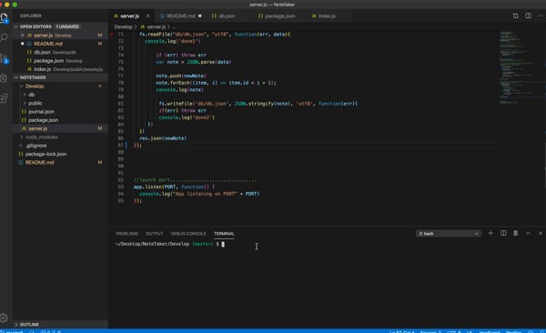

# Note Taker

## Description
This application allows users to be able to save, write, and delete notes so that they can keep track of tasks that need to be completed. The Note Taker app uses an Express back-end and will save and retrieve note data from a JSON file, utilizing API routes.


## Technologies Used

* [HTML](https://developer.mozilla.org/en-US/docs/Web/HTML): used for structuring and creating elements on the DOM
* [CSS](https://developer.mozilla.org/en-US/docs/Web/CSS): used to style html elements on the page
* [JavaScript](https://developer.mozilla.org/en-US/docs/Web/JavaScript): high level programming language
* [Node.js](https://developer.mozilla.org/en-US/docs/Web/API/Node): JavaScript runtime, allows users to run JavaScript on the server
* [Express](https://expressjs.com/): Web framwork for Node.js

## Demo
[Visit the Deployed Site](https://notetaker-ry.herokuapp.com/)

Or

1. Navigate into noteTaker file in terminal
2. run 'npm install' to install dependencies (express) needed for this application
3. Run 'npm start' in terminal, a message saying 'APP listening on PORT 3000' will be displayed. This means the application is running on your server.
4. Type in 'localhost:3000' in your browser, and the site will appear.




## Code Snippet

```
app.use(express.urlencoded({ extended: true }));
app.use(express.json());

app.post("/api/notes", function(req, res){
    var newNote = req.body
    fs.readFile('db/db.json', 'utf8', function(err,data){
        if(err) throw err
        var note = JSON.parse(data)
        note.push(newNote)
        note.forEach((item, i) => item.id = i + 1)
           fs.writeFile('db/db.json', JSON.stringify(note), 'utf8', function(err){
           if(err) throw err
           console.log('Posted note!')
       } )

    })
    res.json(newNote)
})

```
This portion of the script file displays the API route for posting a new note using express. 'app.post' is used to handle POST requests (a 'body parser' is needed to handle POST requests- lines 1-2). The variable 'newNote' is given the value of 'req.body', which is an object containing text from the parsed request body. 'db.json', which is a json file containing all the notes, is read and this data is parsed in order for it to become a Javascript object. 'newNote' is then pushed into the JSON data array, and each post is given an ID so a note with a specific ID can then be deleted later on. 

## Authors

**Rachel Yeung**
* [Portfolio](https://xrachhel.github.io/updatedPortfolio/)
* [Github](https://github.com/xrachhel)
* [LinkedIn](https://www.linkedin.com/in/rachel-yeung-814986159/)

